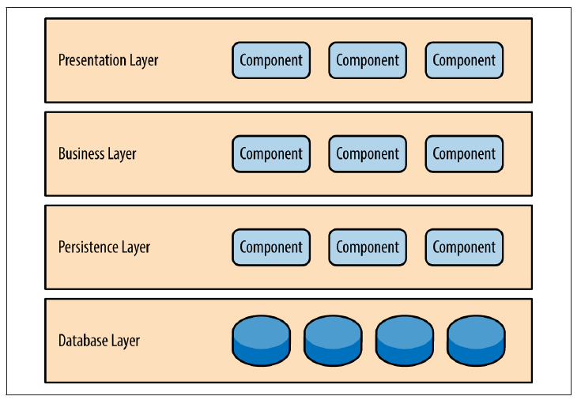
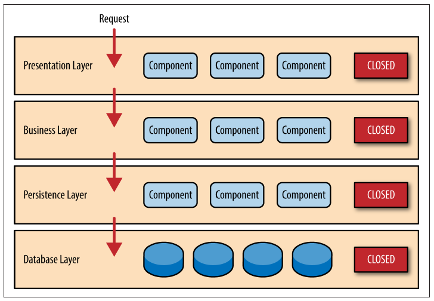
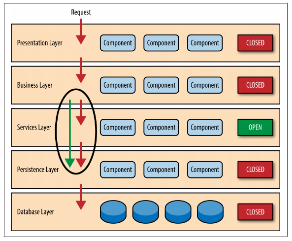
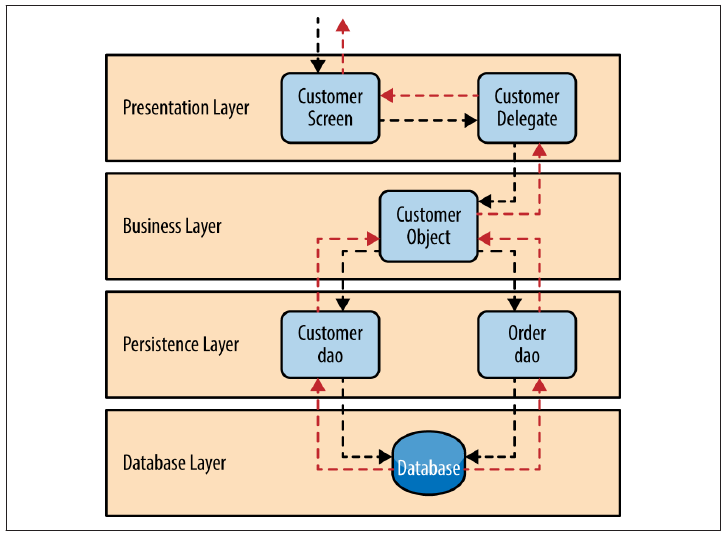

# **N-Tier Architecture**
# **Layered Architecture🔥**

---

# Layared Architecture

The layered architecture pattern closely matches the traditional IT communication and organizational structures found in most companies, making it a natural choice for most business application development efforts.

---

# Key Concepts

- Closed layer
- The layers of isolation

---

# Key Concepts

Leveraging the concept of open and closed layers helps define the relationship between architecture layers and request flows and also provides designers and developers with the necessary information to understand the various layer access restrictions within the architecture.

---

# Pros and Cons

- Advantages
  - Separate of concern
  - More testable
  - Isolation
  - Changeability
- Disdvantages
  - The performance is getting slower as more and more layers added.
  - Leaky abstraction can disturb your layered intent.

---

# Pattern Example

Request from a business user to retrieve customer information for a particular individual.

---

# NodeJS Project Folder structure